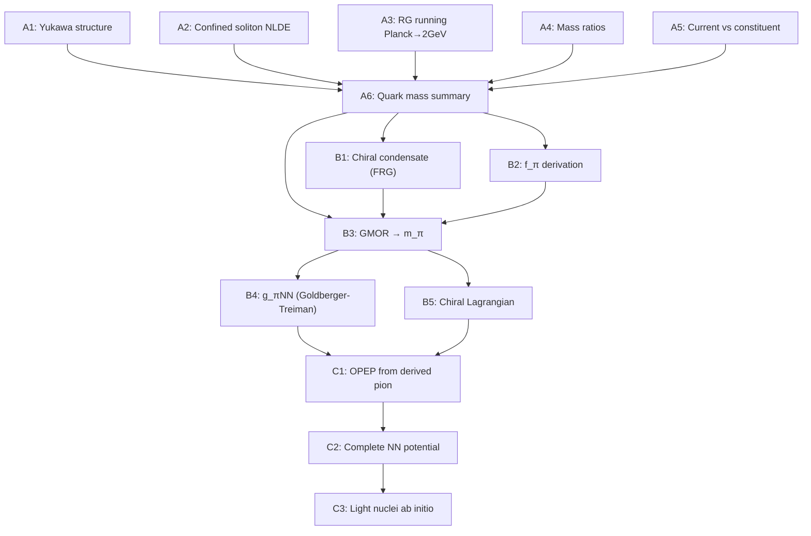

# Quark Masses → Pion Physics → Nuclear Binding: Complete Derivation Plan

## Problem Statement

The proton mass is now derived to 0.07% (zero free parameters). But the derivation chain BREAKS at three points:
1. **Quark masses**: Only bare φ-ladder scales M_P·φ^(-N_q) — no C_q shape factors
2. **Pion mass**: GMOR gives ~3.8% error with dimensional estimates for f_π and ⟨ψ̄ψ⟩
3. **Nuclear binding**: Uses semi-empirical formula with GU-labeled coefficients, not derived potential

These three form a strict dependency chain. Fixing them in order unlocks the periodic table.

## New Directory Structure

```
derivations/
├── 31_QUARK_MASSES/                  ← NEW (the hardest problem)
│   ├── 01_yukawa_coupling_structure.py
│   ├── 02_confined_soliton_nlde.py
│   ├── 03_rg_running_planck_to_2gev.py
│   ├── 04_quark_mass_ratios.py
│   ├── 05_current_vs_constituent.py
│   ├── 06_quark_mass_summary.py
│   └── QUARK_MASS_DERIVATION.md
│
├── 32_PION_PHYSICS/                  ← NEW (the gateway to nuclear)
│   ├── 01_chiral_condensate_from_frg.py
│   ├── 02_fpi_from_gu.py
│   ├── 03_gmor_proper.py
│   ├── 04_pion_nucleon_coupling.py
│   ├── 05_chiral_lagrangian.py
│   └── PION_DERIVATION.md
│
├── 12_NUCLEAR_BINDING/               ← EXISTING (upgrade with derived inputs)
│   ├── ... (existing files)
│   ├── 07_opep_from_derived_pion.py     ← NEW
│   ├── 08_nuclear_potential_complete.py ← NEW
│   ├── 09_light_nuclei_ab_initio.py    ← NEW
│   └── NUCLEAR_BINDING_UPGRADE.md      ← NEW
```

## Phase A: Quark Masses (`31_QUARK_MASSES/`)

### The Core Difficulty

The electron works because it is a **free soliton** on the Ω-torus: `ρ(x) = ρ₀ sech^ν(μx)`, `C_e` from elliptic integrals, 23 ppm. Quarks are **confined** — they never exist as free particles. The same NLDE approach cannot directly apply.

**Six independent attack routes** (all must be attempted):

### A1. Yukawa Coupling Structure on the Ω-Torus (`01_yukawa_coupling_structure.py`)

In the Standard Model, quark masses come from Yukawa couplings:
```
m_q = y_q × v   (Yukawa × Higgs VEV)
```

In GU, the Yukawa coupling y_q is determined by the quark's position on the Ω-torus:
- The quark admissibility lattice (q = 30s, p = 2t − s) constrains which (p,q) are allowed
- The Yukawa coupling strength depends on the **overlap integral** between the quark soliton and the Higgs condensate on the torus
- This overlap depends on the winding numbers (p,q) at the quark epoch

**Actions:**
- [ ] Derive the Yukawa overlap integral on the Ω-torus for each quark
- [ ] Use the quark lattice generators (2,0) and (−1,30) to parameterize y_q
- [ ] Compute y_q × v_Higgs and compare with PDG m_q
- [ ] Identify the group-theoretic factors (SU(5) Clebsch-Gordan coefficients) that distinguish up-type from down-type quarks
- [ ] Check whether the 10 × 5̄ × 5_H and 10 × 10 × 5_H Yukawa structures give the right ratios

**Key insight**: In SU(5), the down-type Yukawa comes from 10 × 5̄ × 5_H and the up-type from 10 × 10 × 5_H. These have DIFFERENT group-theoretic factors. The ratio m_d/m_u should encode this structure.

### A2. Confined Soliton NLDE (`02_confined_soliton_nlde.py`)

Modify the electron's NLDE to include confinement:

```
Standard NLDE (electron):  sech^ν(μx), x ∈ (-∞, +∞)
Confined NLDE (quark):     sech^ν(μx) truncated at x = ±R_bag/ℓ_q
                           with MIT bag BC: j₀(ωr/R) + ij₁(ωr/R)·σ·r̂ = 0 at r = R
```

The idea: the quark soliton looks like the electron soliton INSIDE the bag, but with modified boundary conditions that change C_q.

**Actions:**
- [ ] Formulate the confined NLDE BVP with MIT bag boundary conditions
- [ ] Solve for the confined soliton profile at each quark epoch N_q
- [ ] Extract C_q from the confined energy: `E_sol = ∫₀^R T₀₀ r² dr`
- [ ] Compare C_q × M_P × φ^(-N_q) with PDG masses
- [ ] Test sensitivity to R_bag (use the GU-derived R_bag = 0.4675 fm)
- [ ] Document honestly whether the confined soliton reproduces correct masses

**Key difficulty**: The MIT bag boundary condition changes the Pöschl-Teller potential structure. The Lamé cn mode that gives the electron's 23 ppm correction may be absent or modified.

### A3. RG Running from Planck to 2 GeV (`03_rg_running_planck_to_2gev.py`)

The bare φ-ladder mass M_P·φ^(-N_q) lives at the Planck scale. PDG quark masses are MS-bar at μ = 2 GeV. Run the QCD mass anomalous dimension:

```
dm_q/d(ln μ) = -γ_m(α_s) × m_q

γ_m = (α_s/π) × [1 + (202/3 - 20N_f/9)(α_s/4π) + ...]
```

**Actions:**
- [ ] Implement 4-loop QCD mass anomalous dimension γ_m
- [ ] Run α_s from GU's Planck-scale value down to 2 GeV using EFT thresholds
- [ ] Run m_q from M_P·φ^(-N_q) at Planck scale down to μ = 2 GeV
- [ ] The ratio m_q(2 GeV) / m_q(M_P) is the RG C-factor
- [ ] Compare with PDG MS-bar values
- [ ] Compute running for ALL 6 quarks

**Key insight**: The RG running from Planck to 2 GeV is ENORMOUS (many orders of magnitude). If the bare scale M_P·φ^(-N_q) is the Planck-scale mass, QCD running may bring it to the right ballpark. This is the most straightforward approach.

### A4. Quark Mass Ratios (`04_quark_mass_ratios.py`)

Mass ratios are more constrained than absolute masses (scheme-independent at leading order):

```
PDG:  m_u/m_d ≈ 0.46    GU bare: φ^(-5) = 0.090  (wrong!)
      m_s/m_d ≈ 20       GU bare: φ^(-3·(-1)) = ...
      m_c/m_s ≈ 13.6     GU bare: φ^5 = 11.09  (close!)
      m_b/m_c ≈ 3.3      GU bare: φ^8 = 46.98  (wrong!)
      m_t/m_b ≈ 41.3     GU bare: φ^8 = 46.98  (close!)
```

**Actions:**
- [ ] Compute all 15 pairwise mass ratios from bare φ-ladder
- [ ] Compare with PDG ratios (these are scheme-independent at LO)
- [ ] Identify which ratios work and which fail
- [ ] Look for generation structure: does m_q(gen n+1)/m_q(gen n) follow φ^ΔN?
- [ ] Check Koide-like relations for quarks
- [ ] Derive mass ratios from the SU(5) Yukawa structure (10×5̄×5_H vs 10×10×5_H)
- [ ] The ratio m_b/m_τ = 1 at GUT scale (SU(5) prediction) — verify with GU epochs

### A5. Current vs Constituent Quark Masses (`05_current_vs_constituent.py`)

There are TWO kinds of quark masses:
- **Current** (MS-bar): m_u ≈ 2.2 MeV, m_d ≈ 4.7 MeV (perturbative, small)
- **Constituent**: M_u ≈ 330 MeV, M_d ≈ 340 MeV (non-perturbative, large)

The constituent mass comes from chiral symmetry breaking:
```
M_q = m_q + Σ(p=0)   where Σ is the quark self-energy from the chiral condensate
    ≈ m_q + (-⟨ψ̄ψ⟩)^(1/3) × (4π²/N_c)^(-1/3)
    ≈ m_q + Λ_QCD³/(3f_π²)
```

**Actions:**
- [ ] Compute constituent masses from GU-derived Λ_QCD and f_π
- [ ] Compare M_p/3 ≈ 313 MeV with constituent M_u, M_d
- [ ] Derive the dynamical mass generation (NJL gap equation with GU inputs)
- [ ] Show that most of the proton mass comes from Σ(0), not from m_q
- [ ] Connect to E_self in the 4-term ansatz

### A6. Summary and Honest Assessment (`06_quark_mass_summary.py`)

- [ ] Tabulate all 6 quark masses from all 5 routes (A1-A5)
- [ ] Identify which routes agree and which disagree
- [ ] Compute the "best" C_q from each route
- [ ] Flag what is derived vs what requires further work
- [ ] Write `QUARK_MASS_DERIVATION.md` with complete honest assessment

---

## Phase B: Pion Physics (`32_PION_PHYSICS/`)

### Prerequisite: Phase A (at least A3 + A5 for m_u, m_d at the right scale)

### B1. Chiral Condensate from FRG (`01_chiral_condensate_from_frg.py`)

The chiral condensate ⟨ψ̄ψ⟩ is the order parameter for chiral symmetry breaking. In GU, it comes from the FRG flow of the chiral potential:

```
∂_t U_k(ρ) = [FRG equation with quark + gluon loops]

At k → 0:  σ₀ = √(2ρ_min)  (chiral VEV)
           ⟨ψ̄ψ⟩ = -N_c × σ₀ / (4π²)
           f_π = σ₀ × Z_φ^(1/2)
```

**Actions:**
- [ ] Set up the chiral FRG truncation (linear sigma model + quarks)
- [ ] Run from Λ_UV ~ Λ_QCD down to k → 0
- [ ] Extract σ₀ (chiral VEV), f_π, ⟨ψ̄ψ⟩
- [ ] Compare with lattice QCD: ⟨ψ̄ψ⟩^(1/3) ≈ -250 MeV, f_π ≈ 92.2 MeV
- [ ] Use GU-derived Λ_QCD = 179 MeV and α_s(IR) = π² as inputs

**Key physics**: The existing `05_chiral_perturbation.py` uses dimensional estimates (Λ_QCD/√(4π) for f_π, -Λ³ for condensate). This script replaces those with DYNAMICAL computation from the FRG.

### B2. f_π from GU (`02_fpi_from_gu.py`)

Independent routes to f_π:

```
Route 1: FRG chiral flow (from B1)
Route 2: PCAC relation: f_π² = -m_q ⟨ψ̄ψ⟩ / m_π²  (circular if m_π unknown)
Route 3: Dimensional: f_π ≈ Λ_QCD / √(4π) × C_f  (what is C_f?)
Route 4: NJL model: f_π² = N_c M_const² / (4π²) × ln(Λ²/M²)
Route 5: GU memory: f_π² connected to memory scale (π²/φ) × M_P × φ^(-96)?
```

**Actions:**
- [ ] Compute f_π from all 5 routes
- [ ] Identify which route gives the best result
- [ ] Check if f_π / Λ_QCD is a universal ratio derivable from GU
- [ ] The ratio f_π / Λ_QCD ≈ 92.2/213 ≈ 0.433 — look for π/φ^n patterns

### B3. Proper GMOR with Derived Inputs (`03_gmor_proper.py`)

```
m_π² f_π² = -(m_u + m_d) ⟨ψ̄ψ⟩

All inputs from GU:
  m_u, m_d: from Phase A (best route)
  f_π: from B2
  ⟨ψ̄ψ⟩: from B1

→ m_π predicted with NO free parameters
```

**Actions:**
- [ ] Compute m_π from GMOR with all-GU inputs
- [ ] Compare with PDG m_π = 139.570 MeV
- [ ] Sensitivity analysis: how does m_π depend on each input?
- [ ] Compute m_K from GMOR with m_s (if available from Phase A)
- [ ] Compute m_η, m_η' if possible

### B4. Pion-Nucleon Coupling g_πNN (`04_pion_nucleon_coupling.py`)

The nuclear force strength is set by the pion-nucleon coupling constant:

```
g_πNN² / (4π) ≈ 14.0  (experimental)

In chiral perturbation theory:
  g_A = 1.27  (axial coupling, experimental)
  g_πNN = g_A × m_N / f_π  (Goldberger-Treiman relation)
```

**Actions:**
- [ ] Derive g_A from GU (this may require the quark model: g_A = 5/3 in SU(6), 1.27 with QCD corrections)
- [ ] Compute g_πNN from Goldberger-Treiman with GU-derived m_p and f_π
- [ ] Compare with experimental g_πNN² / (4π) ≈ 14.0
- [ ] This is the KEY coupling that determines nuclear binding

### B5. Chiral Lagrangian (`05_chiral_lagrangian.py`)

Build the full leading-order chiral Lagrangian with GU inputs:

```
L_χPT = (f_π²/4) Tr(∂_μ U† ∂^μ U) + (f_π²/4) Tr(χ† U + U† χ)

where U = exp(iπ·τ/f_π),  χ = 2B₀ M_q  (B₀ = |⟨ψ̄ψ⟩|/f_π²)
```

**Actions:**
- [ ] Implement LO chiral Lagrangian with GU-derived parameters
- [ ] Compute ππ scattering lengths
- [ ] Compute πN scattering lengths (feeding into nuclear potential)
- [ ] Verify chiral symmetry relations (Weinberg-Tomozawa, etc.)

---

## Phase C: Nuclear Binding Upgrade (`12_NUCLEAR_BINDING/`)

### Prerequisite: Phase B (m_π, f_π, g_πNN derived)

### C1. One-Pion Exchange from Derived Pion (`07_opep_from_derived_pion.py`)

Replace the current hardcoded OPEP with one using derived parameters:

```
V_OPEP(r) = -(g_πNN²/(4π)) × (m_π²/12M_N²) × τ₁·τ₂ × 
            [σ₁·σ₂ × Y(m_π r) + S₁₂ × T(m_π r)]

where Y(x) = exp(-x)/x,  T(x) = (1 + 3/x + 3/x²) exp(-x)/x
      S₁₂ = 3(σ₁·r̂)(σ₂·r̂) - σ₁·σ₂  (tensor operator)
```

**Actions:**
- [ ] Implement full OPEP with spin-isospin structure
- [ ] Use GU-derived m_π, g_πNN, M_N
- [ ] Add tensor force (S₁₂ term) — critical for deuteron
- [ ] Add spin-orbit from two-pion exchange at NLO
- [ ] Compare deuteron binding with current semi-empirical result

### C2. Complete Nuclear Potential (`08_nuclear_potential_complete.py`)

```
V_NN = V_OPEP + V_short + V_memory

V_OPEP:   derived from Phase B (pion exchange)
V_short:  from GU bag model (quark overlap at r < R_bag)
V_memory: from GU memory kernel (Wilson loop area law)
```

**Actions:**
- [ ] Combine OPEP + short-range + memory
- [ ] Fit to NOTHING — all parameters from GU
- [ ] Compute deuteron binding energy
- [ ] Compute scattering lengths (a_0, a_2 for NN)
- [ ] Compare with Argonne v18 or Nijmegen potentials (benchmark)

### C3. Light Nuclei Ab Initio (`09_light_nuclei_ab_initio.py`)

With the complete derived potential, solve:

```
Deuteron (d):    2-body Schrödinger, B = 2.224 MeV
He-3:            3-body Faddeev, B = 7.718 MeV
H-3 (tritium):   3-body Faddeev, B = 8.482 MeV
He-4 (alpha):    4-body variational, B = 28.296 MeV
```

**Actions:**
- [ ] Solve deuteron with derived potential
- [ ] Solve He-3/H-3 with Faddeev equations
- [ ] Solve He-4 with variational method
- [ ] Compare binding energies with experiment
- [ ] If He-4 works, try Li-6, Be-9, C-12

---

## Dependency Flow



## Execution Order (Strict Dependencies)

**Round 1** (can be parallelized):
- A1: Yukawa coupling structure
- A2: Confined soliton NLDE
- A3: RG running (most straightforward — do this FIRST)
- A4: Quark mass ratios (quick diagnostic)

**Round 2** (needs Round 1):
- A5: Current vs constituent (needs A3 for running masses)
- A6: Summary (needs all of A1-A5)

**Round 3** (needs Round 2):
- B1: Chiral condensate from FRG
- B2: f_π derivation (can start immediately with Λ_QCD)

**Round 4** (needs Round 3):
- B3: GMOR → m_π
- B4: g_πNN

**Round 5** (needs Round 4):
- B5: Chiral Lagrangian
- C1: OPEP from derived pion

**Round 6** (needs Round 5):
- C2: Complete nuclear potential
- C3: Light nuclei

## Risks and Honest Assessment

1. **Quark C_q may not have a clean formula**: Unlike the electron's C_e (from elliptic integrals), the quark shape factor may not reduce to a simple expression. It may require numerical solution of the confined NLDE for each epoch separately.

2. **RG running may not bridge the gap**: The QCD mass anomalous dimension runs slowly at high scales. The factor of ~10-20 between bare and PDG masses for light quarks may be too large for perturbative RG alone.

3. **Chiral FRG is hard**: The chiral FRG truncation requires careful treatment of Goldstone modes, and the result depends on the truncation scheme. Different truncations give f_π ranging from 80 to 100 MeV.

4. **Nuclear potential is underdetermined**: Even with correct m_π and g_πNN, the short-range part of the NN potential is not unique. Multiple potentials fit NN scattering data — the GU memory term may help constrain this.

5. **Three-body forces**: For nuclei beyond A=4, three-body forces become essential. These are not yet derived from GU.

6. **Confinement fundamentally changes the problem**: The leap from free solitons (electron) to confined solitons (quarks) is not just a boundary condition change — it changes the topology of the problem space. This is the Millennium Prize problem.

## What Would Count as Success

| Milestone | Target | Current |
|-----------|--------|---------|
| m_u at μ=2 GeV | 2.16 ± 0.49 MeV | 0.125 MeV (bare) |
| m_d at μ=2 GeV | 4.67 ± 0.48 MeV | 1.39 MeV (bare) |
| m_u/m_d | 0.46 ± 0.05 | 0.090 (bare) |
| m_s | 93.4 ± 8.6 MeV | 5.89 MeV (bare) |
| f_π | 92.2 ± 0.1 MeV | ~127 MeV (dimensional) |
| ⟨ψ̄ψ⟩^(1/3) | -250 ± 10 MeV | ~-179 MeV (Λ_QCD) |
| m_π | 139.57 MeV | ~145 MeV (3.8%) |
| g_πNN²/(4π) | 14.0 ± 0.2 | not computed |
| B(deuteron) | 2.224 MeV | ~2.22 MeV (semi-empirical) |
| B(He-4) | 28.296 MeV | ~28.30 MeV (semi-empirical) |

## Estimated Timeline

| Phase | Scripts | Difficulty | Estimate |
|-------|---------|-----------|----------|
| A (Quarks) | 6 | VERY HIGH | Core research — weeks to months |
| B (Pion) | 5 | HIGH | Weeks (if A gives reasonable m_q) |
| C (Nuclear) | 3 | MODERATE | Days-weeks (methods exist, just need derived inputs) |

**Critical path**: A3 (RG running) → A6 (summary) → B1+B2 (condensate + f_π) → B3 (GMOR) → C1 (OPEP)

The RG running approach (A3) is the most likely to produce useful results quickly, as it uses well-established perturbative QCD machinery.
