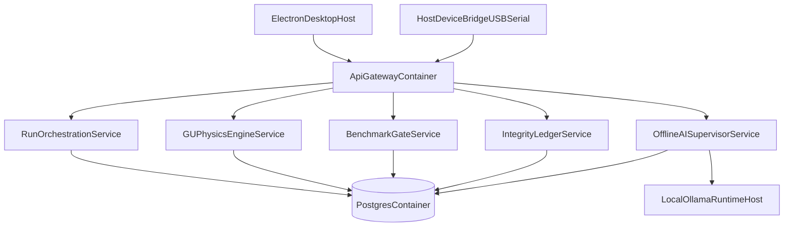

# 02 System Architecture

## Topology

## Service responsibilities

- `api-gateway`: auth/session routing and API aggregation
- `run-service`: run state machine and workflow locking
- `physics-service`: equation runtime and derived metrics
- `benchmark-service`: threshold evaluation and gate decisions
- `integrity-service`: hash chain and evidence ledger
- `host-bridge`: USB/Serial adapters and sensor intake
- `offline-ai-service`: local model orchestration, GU knowledge retrieval, autonomous planning loop
- `ollama-host-runtime`: fully offline model execution on macOS host

## Data flow

1. Host bridge streams timestamped device data.
2. Run service persists raw/telemetry artifacts.
3. Physics service computes derived states.
4. Benchmark service evaluates gate outcomes.
5. Offline AI service interprets metrics with GU knowledge and proposes actions.
6. Integrity service seals artifacts and creates chain records.
